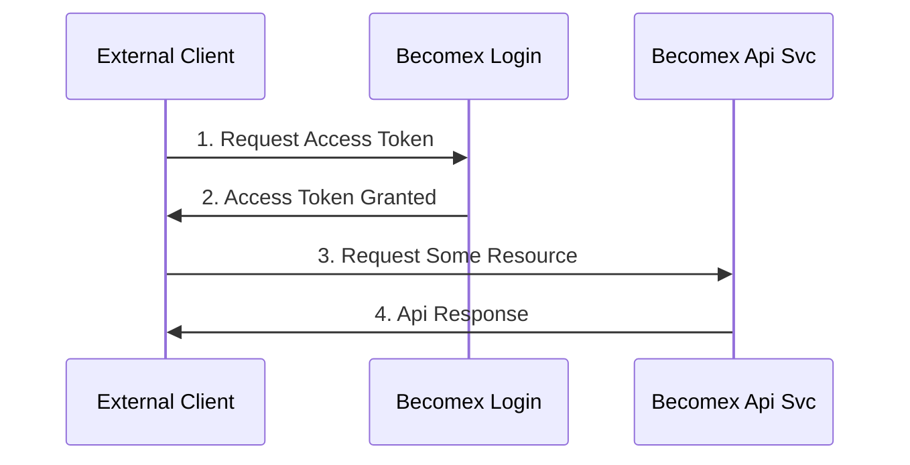

# Becomex Login w/ Java Exemple

This code sample aims to demonstrate how to perform an oAuth2 `client_credentials` flow with `signed_jwt_token` as assertion challenge.

You can simple run this project with following commands. There is a simple console interface to help you to provide the required data.

## Build and Run

```sh
.\gradlew build
.\gradlew app:run -q --console=plain 👩‍💻
```

If you are a heavy user 👩‍🎤 and want to challenge yourself, you can try the single command below. Remember to replace that path strings to your actual files. 🙂

## Test App Settings

```sh
.\gradlew app:run -q --console=plain --args='--keystore "C:\...\ks.p12" --keystore-secret "C:\...\ks.secret.txt" --key-secret "C:\...\pem.secret.txt" --client <<bcx-isp-client-id>> --api https://...' 
```

## Authorization Flow

OAuth is an open-standard authorization protocol that provides applications the ability for secure designated access. Becomex uses the oAuth's `client_secret` configuration to authenticate daemon services to access any internal or external resources.

The application secrets and passwords interchange can be unsecure because third party providers can sniff network packages and grab sensitive data. To prevent this scenario and keep things a little more secure, Becomex has chosen to only accept `client_secret` requests with `signed_jwt_token`s assertions. Which means the client application must generate an assertion token w/ their identity and sign it w/ their secure RSA Private Key.

(1) Once the assertion challenge was generated an `access token request` should be performed to [Becomex ISP](https://login.becomex.com.br/auth/realms/becomex/.well-known/openid-configuration).

(2) The ISP will verify the token signature w/ the Client's RSA Public Key, and if the identity was valid then an `access_token` will be generated and returned.

(3) The `access_token` is also a JWT Token, but instead signed by Becomex's ISP and carring Authentication and Authorization data. This identity should authorize daemon applications to access some api resources in the Becomex public network.

(4) To access some resource, the daemon service should perform an HTTP call including an `Authorization` header with given `access_token`.



### Assertion Token

The assertion token is a simple JWT token signed by the Client's RSA Private Key. This token should carry some special claims to provide properly identity and integrity. Full information about oAuth protocols could be found in the [official openid documentation](https://openid.net/specs/openid-connect-core-1_0.html#ClientAuthentication).

* `jit`: REQUIRED. JWT ID. A unique identifier for the token, which can be used to prevent reuse of the token. These tokens MUST only be used once, unless conditions for reuse were negotiated between the parties; any such negotiation is beyond the scope of this specification.
* `iss`: REQUIRED. Issuer. This MUST contain the client_id of the OAuth Client.
* `sub`: REQUIRED. Subject. This MUST contain the client_id of the OAuth Client.
* `isp`: REQUIRED. Audience. The aud (audience) Claim. Value that identifies the Authorization Server as an intended audience. The Authorization Server MUST verify that it is an intended audience for the token. The Audience SHOULD be the URL of the Authorization Server's Token Endpoint.
* `exp`: OPTIONAL. Time at which the JWT was issued. (Unix timestamp format)
* `iat`: REQUIRED. Expiration time on or after which the ID Token MUST NOT be accepted for processing. (Unix timestamp format)

### Access Token Request

To perform an `access_token` request you should make a HTTP POST request to the `token_endpoint`. The `token_endpoint` can be found in the Openid Configuration file provided by [Becomex ISP](https://login.becomex.com.br/auth/realms/becomex/.well-known/openid-configuration).

The http call is a standard `x-www-form-encoded` request including the follow fields:

* `client_id`: REQUIRED. The Client Id provided by Becomex.
* `grant_type`: REQUIRED. The oAuth grant type, `client_credentials`.
* `client_assertion_type`: REQUIRED. The Openid assertion challenge requirements.
* `client_assertion`: REQUIRED. The JWT Assertion Token previously generated.

Remember to add the `Content-Type` http header with `application/x-www-form-urlencoded` as value.

### Api Calls

With an `access_token` in hands you can now access any autorized resources in the Becomex public cloud. You must include the `Authorization` header in any request with the provided `access_token`.

```bash
curl -X GET -H "Authorization: Bearer accessToken" http://svc.becomex.com.br/api/v1/resource
```

## Useful Openssl PEM transformation commands

Convert .pem to .p12

```bash
openssl pkcs12 -export -out ./keystore.p12 -in ./private-key.pem -name "key-alias/key-id" -nocerts
```

Convert .p12 to .jks

```bash
keytool -importkeystore -srckeystore ./keystore.p12 -srcstoretype pkcs12 -destkeystore ./keystore.jks
```

## References

* <https://docs.oracle.com/cd/E35976_01/server.740/es_admin/src/tadm_ssl_convert_pem_to_jks.html>
* <https://www.baeldung.com/convert-pem-to-jks>
* <https://openid.net/specs/openid-connect-core-1_0.html#ClientAuthentication>
* <https://login.becomex.com.br/auth/realms/becomex/.well-known/openid-configuration>
